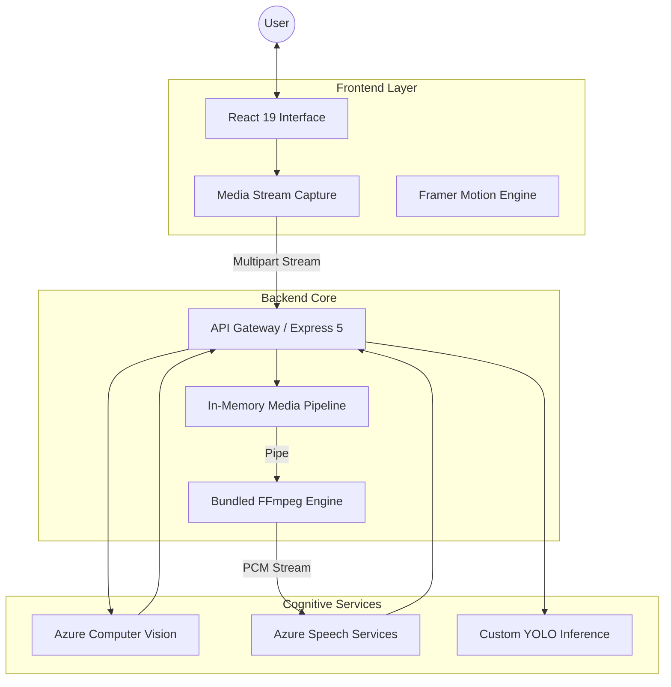

# Spectera

Spectera is an advanced, full-stack demonstration platform for next-generation smart glasses technology. It serves as a bridge between physical perception and digital intelligence, orchestrating real-time computer vision, speech synthesis, and multi-language translation through a high-performance, unified interface.

## System Architecture

Spectera employs a decoupled, event-driven architecture designed for low-latency processing and high availability.



### Core Components

1.  **Frontend (Client Layer)**:
    *   Built with **React 19** and **Vite** for sub-millisecond interactivity.
    *   Utilizes **Tailwind CSS 4** for a modern, responsive design system.
    *   Implements **Locomotive Scroll** and **Framer Motion** for fluid, physics-based UI interactions.
    *   Captures high-fidelity media streams directly from hardware sensors.

2.  **Backend (Processing Layer)**:
    *   Powered by **Node.js** and **Express 5**.
    *   **Zero-Disk I/O Architecture**: Implements in-memory streaming pipelines for audio processing, significantly reducing latency by bypassing filesystem operations.
    *   **Deterministic Runtime**: Features a bundled, self-contained FFmpeg binary for Linux environments, ensuring consistent behavior across diverse deployment targets (Azure App Service, Docker, Local).

3.  **Cloud Intelligence**:
    *   Integrates **Azure AI Services** for enterprise-grade Speech-to-Text and Translation.
    *   Orchestrates custom model inference via dedicated YOLO containers for specialized object detection.

## Key Features & Optimizations

-   **Latency-Optimized Audio Pipeline**: Audio data is streamed directly from memory through the transcoding engine to the inference API, eliminating disk write/read cycles.
-   **Robust Deployment Strategy**: The backend includes a hermetic FFmpeg build, resolving dependency issues in serverless and PaaS environments.
-   **Interactive Demo Mode**: The interface includes built-in guidance systems to ensure optimal sensor positioning and lighting conditions for model accuracy.

## Getting Started

### Backend Setup

1.  Navigate to the `backend` directory.
2.  Install dependencies:
    ```bash
    npm install
    ```
3.  Configure environment variables in a `.env` file (refer to administrator documentation for keys).
4.  Start the server:
    ```bash
    npm run dev
    ```

### Frontend Setup

1.  Navigate to the `frontend` directory.
2.  Install dependencies:
    ```bash
    npm install
    ```
3.  Start the development server:
    ```bash
    npm run dev
    ```

The application will be accessible at `http://localhost:5173`.

## Demo Constraints

*   **Model Limitations**: For demonstration purposes, the models are optimized for speed and general applicability. Specific domain accuracy is limited.
*   **Environment**: Optimal performance requires a well-lit environment and clear audio input (English language preferred for this release).

## Deployment

-   **Frontend**: Execute `npm run build` to generate static assets in the `dist` folder.
-   **Backend**: Deploy to any Node.js 20+ runtime. The repository includes all necessary binaries for Linux x64 environments.

## License

Copyright (c) 2026. All Rights Reserved.